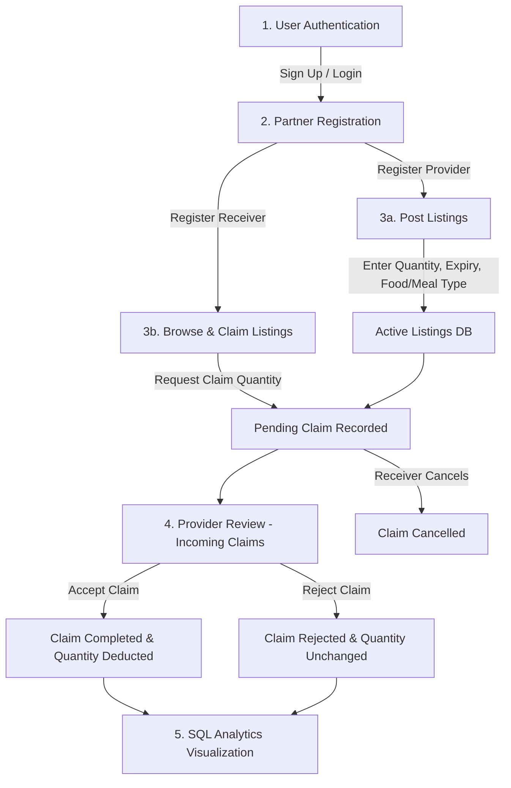

# 🌱 ZeroWaste: Local Food Wastage Management System

Welcome to **ZeroWaste**, a premium, Streamlit-based web application developed to drastically reduce local food waste and bridge the gap between food abundance and food insecurity. The application connects local **Food Providers** (restaurants, grocery stores, bakeries, individuals) with local **Receivers** (NGOs, shelters, community centers, individuals) through a unified database platform. 

This system enables real-time listing publication, automated transaction/claim routing, partner directories, and robust, SQL-powered analytics with premium interactive charts.

---

## 📸 Visual Walkthrough & Features

### 🔒 User Authentication & Security
The system features a secure credentials-based auth system. Users can create a unique account or sign in to establish a session, ensuring they can only modify their own listings, claims, or registrations.
<p align="center">
  
</p>

### 🌱 Home Page (Understand)
Our landing dashboard welcomes users with live, aggregated environmental and social impact metrics dynamically calculated using subqueries from the SQLite database. It includes a comprehensive, step-by-step workflow guide.
<p align="center">
  
</p>

### 👥 Partner Registration (Register)
Users can register themselves as food providers or food receivers. The registration process maps physical addresses, cities, types of organizations, and contacts. The **Active Directories** tab provides a searchable directory of partners filtered by city or name.
<p align="center">
  
</p>

### 🍱 Food Marketplace (Act)
In the Marketplace, providers list surplus food items (detailing quantities, categories, meal timings, and expiry dates). Receivers browse all available postings, apply filters, and request claims.
<p align="center">
  
</p>

### 📋 My Dashboard & Claim Settlement (Track)
A private dashboard allows users to manage their profiles, update/delete listings, and monitor requests. 
* **Providers** can approve or reject incoming claims in real-time under **Incoming Claims**. Approving a claim automatically decrements the listing inventory.
* **Receivers** track status (Pending, Completed, Cancelled) and can cancel pending claims.
<p align="center">
  
</p>
<p align="center">
  
</p>
<p align="center">
  
</p>

### 📊 Analytics Dashboard (Decide)
The analytics panel executes 15 advanced SQL queries to analyze patterns. It features an interactive **Data Source Toggle** allowing users to switch between the **Original Raw Data (Static)** and the **Live App Data (Active)** to compare baseline historical trends with active platform usage.
<p align="center">
  
</p>
<p align="center">
  
</p>
<p align="center">
  
</p>

---

## 🔄 End-to-End Workflow

The application coordinates redistributions through an automated, state-driven workflow:



---

## 💾 Database Schema & Architecture

The database architecture is designed with **SQLite** for clean, file-based deployment. It enforces integrity using primary keys, foreign key constraints (with `ON DELETE CASCADE` triggers), and `CHECK` quantity rules.

```
                  +------------------+
                  |      Users       |
                  +------------------+
                  | User_ID (PK)     |<----------+
                  | Username         |           | (Created_By)
                  | Password_Hash    |           |
                  | Display_Name     |           |
                  | Created_At       |           |
                  +------------------+           |
                           |                     |
             +-------------+-------------+       |
             |                           |       |
             v                           v       |
  +------------------+       +------------------+ |
  |    Providers     |       |    Receivers     | |
  +------------------+       +------------------+ |
  | Provider_ID (PK) |       | Receiver_ID (PK) | |
  | Name             |       | Name             | |
  | Type             |       | Type             | |
  | Address          |       | City             | |
  | City             |       | Contact          | |
  | Contact          |       | Created_By (FK) -| |
  | Created_By (FK) -|       +------------------+ |
  +------------------+                 |          |
           |                           |          |
           |                           | (ON DELETE CASCADE)
           v                           v          |
  +------------------+       +------------------+ |
  |  Food_Listings   |       |      Claims      | |
  +------------------+       +------------------+ |
  | Food_ID (PK)     |<------| Claim_ID (PK)    | |
  | Food_Name        | (FK)  | Food_ID (FK)     | |
  | Quantity (CHECK) |       | Receiver_ID (FK) |-|
  | Expiry_Date      |       | Status           | |
  | Provider_ID (FK) |       | Timestamp        | |
  | Provider_Type    |       | Claim_Quantity   | |
  | Location (City)  |       | Created_By (FK) -| |
  | Food_Type        |       +------------------+ |
  | Meal_Type        |                            |
  | Created_By (FK) -|----------------------------+
  +------------------+
```

### Table Definitions
1. **`Users`**: Holds credentials, display names, and registration timestamps.
2. **`Providers`**: Stores surplus food sources (e.g. Restaurants, Supermarkets).
3. **`Receivers`**: Stores beneficiaries claiming food (e.g. NGOs, Shelters).
4. **`Food_Listings`**: Tracks active food posts, linking to Providers, ensuring `Quantity >= 0`.
5. **`Claims`**: Routes claim transactions, linking Food and Receivers, defaulting status to `'Pending'`.

---

## 📊 The 15 SQL Analytical Queries

The platform includes a query interpreter that runs 15 structured analytical queries. Users can inspect the raw SQL, run it on their chosen database source (static raw data vs. active data), and visualize it.

| # | Query Title | SQL Analytical Focus | Plotly Visualization Type |
|---|-------------|----------------------|---------------------------|
| **1** | Temporal Trends of Food Claims | Track claim volume distributions over time | Chronological Line Chart with markers |
| **2** | Top Contributing Provider Types | Identify which provider types donate the largest quantities | Donut Chart (Yellow palette) |
| **3** | Provider Contact Directory by City | Filter and lookup contact numbers/addresses of local providers | Interactive Markdown Dataframe Table |
| **4** | Top Claiming Receivers | Rank receiver organizations by total food units successfully claimed | Horizontal Bar Chart (Blue palette) |
| **5** | Food Availability Summary | Display proportion of total food listed vs. unclaimed/available | Donut Chart (Green semantic mapping) |
| **6** | Cities with Highest Food Listings | Analyze city-wise distribution of listings and quantities | Dual-Axis Combo Chart (Bar & Scatter Line) |
| **7** | Commonly Available Food Types | Breakdown available food categories (Vegetarian, Vegan, Non-Veg) | Donut Chart (Food type color map) |
| **8** | Claims per Food Item | Identify which food items receive the highest request densities | Horizontal Bar Chart by Food Type |
| **9** | Providers with Highest Successful Claims | Ranks providers who complete the most claim transfers | Grouped Bar Chart (Green palette) |
| **10**| Claim Status Percentage Breakdown | Evaluate operational efficiency (Completed vs. Pending vs. Cancelled) | Donut Chart (Status semantic mapping) |
| **11**| Average Quantity Claimed per Receiver | Analyze the average batch sizes claimed by receivers | Horizontal Bar Chart with value-based gradient |
| **12**| Meal Type Demand | Map claim volume spikes according to meal times (Lunch, Dinner) | Vertical Bar Chart (Red palette) |
| **13**| Total Quantity Donated by Provider | Evaluate cumulative donation volumes for each provider profile | Horizontal Bar Chart (Provider color map) |
| **14**| Average Quantity Listed by Food Type | Track listing size differences based on food categories | Vertical Bar Chart (Food type color map) |
| **15**| Top 10 Listings Closest to Expiry | Extract active food items nearing their expiration dates | Highlighted Expiry Alert Table |

---

## 🛠️ Technology Stack

* **Frontend UI**: [Streamlit](https://streamlit.io/) (utilizing custom fonts, responsive layouts, glassmorphic containers, and styled buttons).
* **Database Engine**: [SQLite](https://www.sqlite.org/) (independent file database engine utilizing SQLite3).
* **Data Processing**: [Pandas](https://pandas.pydata.org/) (dataframes ingestion, date parsing, sorting, and manipulation).
* **Visualizations**: [Plotly Express & Graph Objects](https://plotly.com/python/) (high-performance interactive dark charts).
* **Style Engine**: Vanilla CSS (embedded in python via `st.markdown` injection to override default Streamlit aesthetics).

---

## ⚡ Setup & Installation

### 1. Prerequisites
Ensure you have **Python 3.8+** installed.

### 2. Clone the Repository & Install Dependencies
Navigate to the project root directory and install dependencies:
```bash
pip install -r requirements.txt
```

### 3. Database Initialization & Data Clean Ingestion
Initialize the active and static databases. This script parses, cleans, formats raw dates, maps canonical food types from the CSV files in `data/`, and structures the SQLite database:
```bash
python database/init_db.py
```
> [!NOTE]
> Running this script will automatically create `database/food_waste.db` and `database/food_waste_static.db`.

### 4. Run the Streamlit Application
Start the local server and open the application in your browser:
```bash
streamlit run app/main.py
```

---

## 🛡️ Project Directory Structure

```
├── data/                             # Raw dataset source files
│   ├── 5_Full_Data(food waste).xlsx  # Original excel source
│   ├── providers_data.csv            # Provider base records
│   ├── receivers_data.csv            # Receiver base records
│   ├── food_listings_data.csv        # Food listing base records
│   └── claims_data.csv               # Claim transaction records
│
├── database/                         # Database scripts & storage
│   ├── init_db.py                    # Database creation & cleaning script
│   ├── queries.py                    # 15 SQL query compiler
│   ├── food_waste.db                 # Active DB (created at runtime)
│   └── food_waste_static.db          # Static DB (created at runtime)
│
├── app/                              # Web application files
│   ├── main.py                       # Main routing & application entryway
│   │
│   ├── components/                   # UI sections
│   │   ├── auth_page.py              # Login & signup layouts
│   │   ├── education.py              # Home / Mission & Impact section
│   │   ├── registration.py           # Provider/Receiver Registration forms
│   │   ├── marketplace.py            # List food & Claim food tabs
│   │   └── user_dashboard.py         # Expanders to update/delete/approve
│   │
│   └── utils/                        # Utilities & styling
│       ├── auth_utils.py             # Password hashing & sessions helper
│       ├── db_utils.py               # SQL queries & DML executors
│       ├── style_utils.py            # Dark mode glassmorphic CSS injector
│       └── chart_utils.py            # Plotly theme styling & color maps
│
├── requirements.txt                  # Python dependencies
└── README.md                         # Project documentation
```
